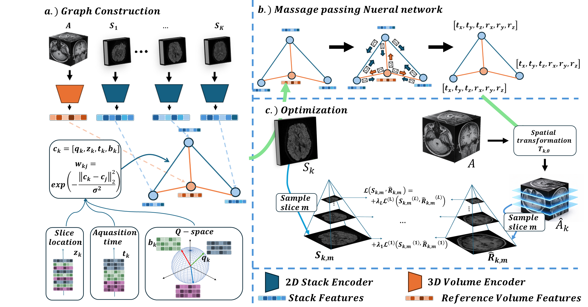

# GraphSVR
**GraphSVR: q-Space–Aware Graph-Based Slice-to-Volume Registration for Diffusion MRI**

**Authors:** Noga Kertes¹˒², Daphna Link Sourani¹˒², Alex M. Bronstein³˒⁴, and Moti Freiman¹˒²

**Affiliations:**  
¹ Faculty of Biomedical Engineering, Technion – Israel Institute of Technology, Haifa, Israel  
² The May-Blum-Dahl MRI Research Center, Faculty of Biomedical Engineering, Technion – Israel Institute of Technology, Haifa, Israel  
³ The Taub Faculty of Computer Science, Technion – Israel Institute of Technology, Haifa, Israel  
⁴ Institute of Science and Technology Austria (ISTA), Klosterneuburg, Austria  

**Correspondence:** noga.kertes@campus.technion.ac.il

GraphSVR is a q-space-aware graph-based framework for 4D slice-to-volume registration (SVR) in diffusion MRI. Slice groups are represented as graph nodes, while graph edges encode relationships in acquisition time, slice location, and diffusion encoding. A graph neural network estimates stack-wise rigid motion using subject-specific, self-supervised (zero-shot) optimization against an anatomical reference image.

The implementation in this repository is the code accompanying the GraphSVR paper. The default command-line parameters match the experimental configuration described in the manuscript where possible (including `k=4`, two attention layers, four heads, hidden size 64, batch size 120, learning rate `1e-3`, and up to 400 epochs).



## Case input format

Each case must be stored in one directory containing exactly the following required inputs:

```text
case/
├── dwi.nii.gz
├── dwi.bval
├── dwi.bvec
├── dwi_mask.nii.gz
├── slspec.txt
└── t1.nii.gz
```

- **`dwi.nii.gz`** — 4D diffusion-weighted image, with shape `(X, Y, Z, N)`.
- **`dwi.bval`** — b-values, one value per DWI volume.
- **`dwi.bvec`** — diffusion gradient directions, one 3-vector per DWI volume.
- **`dwi_mask.nii.gz`** — 3D mask defined in the common DWI/T1 image space.
- **`t1.nii.gz`** — 3D anatomical reference. It must already be resampled/registered to the same spatial grid and coordinate system as the DWI (same spatial dimensions and affine).
- **`slspec.txt`** — slice-group specification in the same row-wise format used by FSL `eddy` for multiband acquisitions. Each row contains the slice indices acquired together. Every DWI slice must occur exactly once.

GraphSVR validates the required files, image dimensionality, image grid/affine agreement, gradient-table length, finite values, and the `slspec.txt` slice indices before optimization starts. Input slice indices are zero-based.

> **Important:** GraphSVR does not perform DWI/T1 preprocessing, susceptibility correction, distortion correction, or initial anatomical registration. Prepare the inputs in the common image space before running this code.

## Installation

The supplied Conda environment targets Python 3.11 and a CUDA 11.8 PyTorch build:

```bash
conda env create -f environment.yml
conda activate graphsvr
```

If your machine uses a different CUDA version (or CPU-only PyTorch), install the appropriate PyTorch build for your system and then install `torch-geometric==2.7.0`.

## Run one case

From the repository root:

```bash
python scripts/register_case.py \
  --case_path /path/to/case \
  --save_exp_path /path/to/results \
  --exp_name subject01
```

By default, GraphSVR automatically selects `cuda:0` when CUDA is available and otherwise uses the CPU. You can select a device explicitly:

```bash
python scripts/register_case.py \
  --case_path /path/to/case \
  --save_exp_path /path/to/results \
  --device cuda:1
```

For the full list of options:

```bash
python scripts/register_case.py --help
```

Useful options include `--batch_size`, `--num_epochs`, `--k_for_a_matrix`, `--hidden`, `--heads`, `--layers`, `--multi_scale_loss` / `--no-multi_scale_loss`, and `--num_workers`.

## Outputs

Each run creates a timestamped directory under `--save_exp_path`, for example:

```text
results/
└── subject01_20260809_143000/
    ├── pred_rigid_trans.pt
    └── run_metadata.pt
```

`pred_rigid_trans.pt` contains one `4 x 4` PyTorch transform matrix per slice group, ordered in the same sequence as the DWI volumes and the rows of `slspec.txt`. The matrices are the normalized-coordinate transforms used by PyTorch `affine_grid` / `grid_sample` in the registration code. `run_metadata.pt` records basic run information and the transform convention.

When TensorBoard logging is enabled (the default), event files are written by PyTorch's `SummaryWriter`. Disable logging with `--no_tensorboard`.

## Reproducibility and implementation notes

The command-line entry point seeds Python, NumPy, and PyTorch and requests deterministic PyTorch algorithms when possible. The final saved transforms are produced in a separate inference pass using the best-loss model state, so all saved stack estimates come from one coherent set of model parameters rather than from intermediate optimization updates.

The code intentionally keeps only modules needed by the public `register_case.py` workflow. Simulation-generation, plotting/analysis, notebook, cache, and local run artifacts from development are not included in the cleaned public repository.

## Citation

If you use this code, please cite the accompanying manuscript:

```bibtex
@misc{graphsvr,
  author       = {Noga Kertes and Alex M. Bronstein and Moti Freiman},
  title        = {GraphSVR: q-Space--Aware Graph-Based Slice-to-Volume Registration for Diffusion MRI},
  howpublished = {Manuscript and accompanying software},
  note         = {GraphSVR}
}
```

Please update the BibTeX entry with the final venue, year, DOI, and proceedings information once the paper is formally published.
